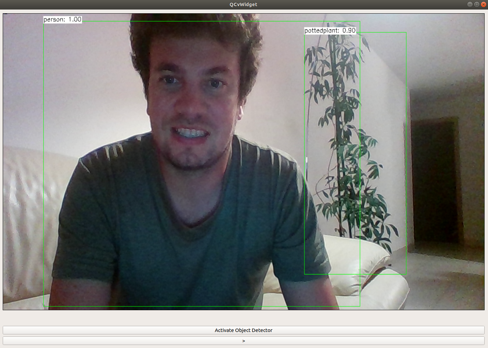

# Object detector with Opencv and Qt

The pupose of this application is to capture video from a camera, apply a YOLO Object detector and display it on a simple Qt Gui.

## Processing

The processing of the Yolo Detector (10 CNN) took ~0.5 seconds on 7 cores. In order to have a fluid application, not all images could be processed. I used thread 1 and a timer to grab the images every milliseconds.
On another thread, the processing were done. Once finished it sends the output of the layer to the thread 1 and received a new image. I used QThread for the implementation

## Data needed

To work, the application need the trained weights of the neural network. You can find there:
*https://pjreddie.com/media/files/yolov3.weights

The configuration of the neural network can be found here:
*https://github.com/pjreddie/darknet/blob/master/cfg/yolov3.cfg

*https://github.com/pjreddie/darknet/blob/master/data/coco.names

All three files must be placed in a folder called "data" in the cmake directory

